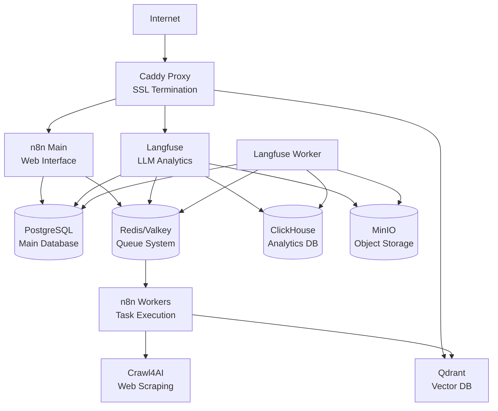

# Подробное руководство по развертыванию n8n с микросервисной архитектурой

## Введение

Данный урок расширяет базовую концепцию самостоятельного развертывания n8n, представляя комплексное решение с микросервисной архитектурой, включающее аналитику, мониторинг, векторные базы данных и автоматическое получение SSL-сертификатов.

## Архитектура системы

Наша система состоит из следующих компонентов:

### Основные сервисы

1. **n8n** - Основная платформа автоматизации
2. **PostgreSQL** - Основная база данных
3. **Redis (Valkey)** - Кеш и система очередей
4. **Caddy** - Reverse proxy с автоматическими SSL-сертификатами

### Дополнительные сервисы

5. **Qdrant** - Векторная база данных для AI/ML задач
6. **Crawl4AI** - Сервис для извлечения данных с веб-сайтов
7. **Langfuse** - Система мониторинга и аналитики LLM
8. **ClickHouse** - Аналитическая база данных
9. **MinIO** - S3-совместимое объектное хранилище

## Детальная настройка конфигурации

### 1. Настройка переменных окружения (.env)

#### Обязательные переменные для n8n:
```bash
# Ключи шифрования n8n (установите длинные и безопасные строки)
N8N_ENCRYPTION_KEY=secret_pass_string
N8N_USER_MANAGEMENT_JWT_SECRET=secret_pass_string

# Пароль для PostgreSQL
POSTGRES_PASSWORD=secret_pass_string

# API ключ для Qdrant
QDRANT_API_KEY=secret_pass_string
```

#### Переменные для продакшн-развертывания:
```bash
# Ваши домены
USER_DOMAIN_NAME=yourdomain.com
N8N_HOSTNAME=n8n.yourdomain.com
QDRANT_HOSTNAME=qdrant.yourdomain.com
LANGFUSE_HOSTNAME=langfuse.yourdomain.com

# Email для Let's Encrypt SSL-сертификатов
LETSENCRYPT_EMAIL=yourdomain@yourdomain.com
```

### 2. Конфигурация n8n (docker-compose.yaml)

#### n8n-import сервис:
- **Назначение**: Импорт данных при первом запуске
- **Особенности**: Запускается один раз, затем завершается
- **Зависимости**: Требует готовой базы данных PostgreSQL

#### n8n основной сервис:
```yaml
environment:
  DB_TYPE: postgresdb
  EXECUTIONS_MODE: queue  # Режим очередей для масштабирования
  N8N_RUNNERS_ENABLED: true  # Включение воркеров
  QUEUE_BULL_REDIS_HOST: redis  # Использование Redis для очередей
  N8N_COMMUNITY_PACKAGE_ENABLED: true  # Поддержка community пакетов
```

#### n8n-worker сервис:
- **Назначение**: Обработка задач из очереди
- **Масштабирование**: Количество реплик задается через `N8N_WORKER_COUNT`
- **Ресурсы**: Изолированные воркеры для параллельной обработки

### 3. Система баз данных

#### PostgreSQL:
- **Версия**: Последняя стабильная
- **Healthcheck**: Проверка готовности каждые 3 секунды
- **Использование**: Основная БД для n8n и Langfuse

#### Redis (Valkey):
- **Назначение**: Система очередей и кеширование
- **Особенности**: Использует Valkey (форк Redis)
- **Настройки**: Автосохранение каждые 30 секунд при изменении 1+ ключа

### 4. Reverse Proxy (Caddy)

#### Автоматические SSL-сертификаты:
```caddyfile
{
    email {$LETSENCRYPT_EMAIL}
}

# Автоматическое получение Let's Encrypt сертификатов для доменов
{$N8N_HOSTNAME} {
    reverse_proxy n8n:5678
}
```

#### Безопасность:
- Отключение всех capabilities (`cap_drop: ALL`)
- Добавление только необходимых прав (`NET_BIND_SERVICE`)
- Ограничение логирования (1MB, 1 файл)

### 5. AI/ML сервисы

#### Qdrant (векторная БД):
```yaml
environment:
  - QDRANT__SERVICE__API_KEY=${QDRANT_API_KEY}
expose:
  - "6333"  # Только внутренний доступ
```

#### Crawl4AI:
- **Память**: 4GB (рекомендуется для браузерных операций)
- **SHM размер**: 1GB для стабильной работы браузера
- **CPU лимит**: 1 ядро

### 6. Система мониторинга Langfuse

#### Компоненты:
- **langfuse-web**: Веб-интерфейс
- **langfuse-worker**: Фоновые задачи
- **clickhouse**: Аналитическая БД
- **minio**: Объектное хранилище

#### Профили:
```yaml
profiles:
  - langfuse  # Активируется при запуске с --profile langfuse
```

## Пошаговое развертывание

### Шаг 1: Подготовка сервера
1. **Минимальные требования**:
   - 4 CPU ядра
   - 8GB RAM
   - 100GB SSD
   - Ubuntu 22.04

2. **Установка Docker и Docker Compose**:

<https://docs.docker.com/engine/install/ubuntu/>

```bash
# Ubuntu/Debian
curl -fsSL https://get.docker.com -o get-docker.sh
sudo sh get-docker.sh
sudo usermod -aG docker $USER

# Установка Docker Compose
sudo curl -L "https://github.com/docker/compose/releases/download/v2.21.0/docker-compose-$(uname -s)-$(uname -m)" -o /usr/local/bin/docker-compose
sudo chmod +x /usr/local/bin/docker-compose
```

### Шаг 2: Настройка DNS
1. Создайте A-записи для ваших доменов:
   - `n8n.yourdomain.com` → IP сервера
   - `qdrant.yourdomain.com` → IP сервера
   - `langfuse.yourdomain.com` → IP сервера

### Шаг 3: Конфигурация проекта
1. **Клонирование и настройка**:
```bash
git clone git@github.com:MiXaiLL76/n8n_deploy_example.git
cd n8n_deploy_example
```

2. **Редактирование .env файла**:
```bash
cp .env.example .env
nano .env
```

3. **Генерация секретных ключей**:
```bash
# Для Langfuse encryption key
openssl rand -hex 32

# Для других ключей используйте длинные случайные строки
```

### Шаг 4: Запуск основных сервисов
```bash
# Запуск основной системы
docker-compose up -d

# Проверка статуса
docker-compose ps

# Просмотр логов
docker-compose logs -f n8n
```

### Шаг 5: Запуск дополнительных сервисов (опционально)
```bash
# Запуск с профилем Langfuse
docker-compose --profile langfuse up -d

# Проверка всех сервисов
docker-compose --profile langfuse ps
```

### Шаг 6: Первоначальная настройка

#### n8n:
1. Откройте `https://n8n.yourdomain.com`
2. Создайте учетную запись администратора
3. Настройте первые workflow'ы

#### Langfuse (если включен):
1. Откройте `https://langfuse.yourdomain.com`
2. Войдите с учетными данными из `.env`
3. Настройте проекты и интеграции

## Мониторинг и обслуживание

### Проверка состояния сервисов:
```bash
# Статус всех контейнеров
docker-compose ps

# Использование ресурсов
docker stats

# Логи конкретного сервиса
docker-compose logs -f [service-name]
```

### Резервное копирование:
```bash
# Backup PostgreSQL
docker-compose exec postgres pg_dump -U postgres postgres > backup_$(date +%Y%m%d).sql

# Backup n8n data
tar -czf n8n_storage_backup.tar.gz ./n8n_storage/

# Backup Qdrant
tar -czf qdrant_backup.tar.gz ./qdrant_storage/
```

### Обновление сервисов:
```bash
# Обновление образов
docker-compose pull

# Перезапуск с новыми образами
docker-compose up -d

# Очистка старых образов
docker image prune
```

## Масштабирование

### Увеличение воркеров n8n:
```bash
# В .env файле
N8N_WORKER_COUNT=3

# Перезапуск
docker-compose up -d --scale n8n-worker=3
```

### Мониторинг производительности:
- **Redis**: Мониторинг очередей через Redis CLI
- **PostgreSQL**: Использование pg_stat для анализа производительности
- **Caddy**: Анализ access логов

## Безопасность

### Рекомендации:
1. **Регулярное обновление**: Обновляйте образы Docker еженедельно
2. **Файрвол**: Закройте все порты кроме 80, 443, и SSH
3. **Мониторинг**: Настройте алерты на высокое использование ресурсов
4. **Backup**: Автоматическое резервное копирование каждые 24 часа
5. **SSL**: Используйте только HTTPS для всех сервисов

### Логирование:
- Все сервисы ограничивают размер логов до 1MB
- Ротация логов происходит автоматически
- Для долгосрочного хранения настройте централизованное логирование

## Troubleshooting

### Частые проблемы:

1. **n8n не запускается**:
   - Проверьте подключение к PostgreSQL
   - Убедитесь в правильности переменных окружения

2. **SSL-сертификаты не получаются**:
   - Проверьте DNS-записи
   - Убедитесь в доступности портов 80/443

3. **Высокое использование памяти**:
   - Ограничьте количество воркеров
   - Проверьте сложные workflow'ы

4. **Проблемы с очередями**:
   - Перезапустите Redis
   - Проверьте соединение между n8n и Redis

## Диаграмма архитектуры



## Заключение

Данная архитектура обеспечивает:
- **Высокую доступность** через систему очередей и воркеров
- **Масштабируемость** горизонтально и вертикально
- **Безопасность** через автоматические SSL-сертификаты
- **Мониторинг** через Langfuse и системные метрики
- **AI/ML возможности** через Qdrant и Crawl4AI

Система готова для продакшн-использования и может обрабатывать значительные нагрузки при правильной настройке ресурсов сервера.

## Практические задания

### Задание 1: Базовое развертывание
1. Разверните базовую конфигурацию n8n с PostgreSQL и Redis
2. Настройте домен и получите SSL-сертификат
3. Создайте простой workflow для тестирования

### Задание 2: Масштабирование
1. Добавьте дополнительные воркеры n8n
2. Протестируйте нагрузку с множественными задачами
3. Мониторьте использование ресурсов

### Задание 3: Интеграция AI
1. Настройте Qdrant и создайте коллекцию векторов
2. Интегрируйте Crawl4AI для извлечения данных
3. Создайте workflow с AI-обработкой данных

### Задание 4: Мониторинг
1. Запустите Langfuse
2. Настройте мониторинг LLM вызовов
3. Проанализируйте метрики производительности